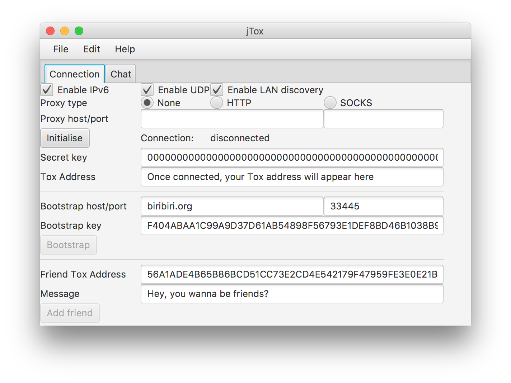

# Java Tox client

This is a simple test client for tox4j.

## Contributing

We're using the standard Github workflow for our code reviews. Just open Pull
Requests and the reviewer will guide you through the process.

# Building jTox

## Dependencies: compile

To build the package itself, the following dependencies are required:

-   org.toktok:tox4j-c_2.11:0.2.1
-   org.openjfx:javafx-controls:11
-   org.openjfx:javafx-fxml:11
